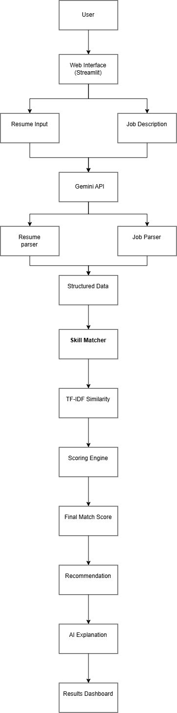
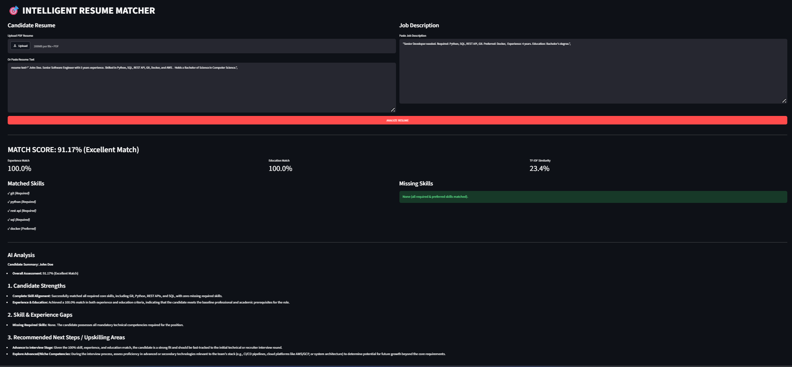

# Intelligent Resume Matcher

An AI-powered resume matching system that combines Google Gemini for information extraction with traditional NLP and rule-based scoring to evaluate candidate-job fit.

## Overview
The Intelligent Resume Matcher analyzes a candidate's resume against a job description and produces a reproducible match score. The system uses Gemini for semantic understanding and structured data extraction, while all scoring is performed using deterministic algorithms.
## Features
- Gemini-powered resume and job description parsing
- Skill extraction and normalization
- Exact skill matching
- TF-IDF + Cosine Similarity
- Experience and education matching
- Weighted scoring system
- Explainable recommendations
- Evaluation and adversarial testing

## Tech Stack
- Python
- Google Gemini API
- Streamlit
- Scikit-learn
- Pandas
- NumPy

## Project Objective
The goal of this project is to demonstrate how Large Language Models (LLMs) can work alongside traditional NLP techniques. Gemini is used to understand and extract information, while all candidate scoring is performed using a deterministic algorithm to ensure transparency, consistency, and reproducibility.
## What Gemini Does
- Resume understanding
- Job description understanding
- Information extraction
- Structured JSON generation
- Optional explanation generation

### Extracted Resume Data
- Name
- Skills
- Education
- Experience
- Projects
- Certifications
- Tools

### Extracted Job Data
- Required Skills
- Preferred Skills
- Experience Requirements
- Education Requirements
- Responsibilities

## What Gemini Does NOT Do
- Calculate final scores
- Rank candidates
- Assign percentages
- Make hiring decisions

The final score is always generated using custom Python scoring logic. 
## System Architecture
  
     User
      ↓
 Web Interface
      ↓
  ┌─────────────┬
  │             │
 Resume      Job Description
   │           │
   └────┬──────┘
        ↓ 
  Gemini API
      ↓
 ┌─────────────┬
 │             │
Resume      Job Parser
Parser        
 │           │
 └────┬──────┘
      ↓
Structured Data
      ↓
Skill Matcher
      ↓
TF-IDF Similarity
      ↓
Scoring Engine
      ↓
Final Match Score
      ↓
Recommendation
      ↓
AI Explanation
      ↓
Results Dashboard

## Project Structure

```text
intelligent-resume-matcher/
│
├── app/
│   ├── main.py
│   ├── gemini_client.py
│   ├── resume_parser.py
│   ├── job_parser.py
│   ├── skill_matcher.py
│   ├── similarity.py
│   ├── scoring.py
│   └── explanation.py
│
├── data/evaluation_dataset
├── tests/
├── requirements.txt
├── .env
└── README.md
```

## Installation

### Clone Repository

```bash
git clone https://github.com/SakshiKumari-a/intelligent-resume-matcher.git
cd intelligent-resume-matcher
```

### Create Virtual Environment

```bash
python -m venv venv
```

Windows:

```bash
venv\Scripts\activate
```

Linux / Mac:

```bash
source venv/bin/activate
```

### Install Dependencies

```bash
pip install -r requirements.txt
```

### Configure Environment Variables

Create a `.env` file:

```env
GEMINI_API_KEY=   your_API_KEY
```

### Run Application

```bash
streamlit run app/main.py
```

or

```bash
python app/main.py
```

## NLP Pipeline

### Resume Extraction

```python
extract_resume_information(resume_text)
```

Extracts:
- Name
- Skills
- Education
- Experience
- Projects
- Certifications
- Tools

### Job Extraction

```python
extract_job_requirements(job_description)
```

Extracts:
- Required Skills
- Preferred Skills
- Experience Requirements
- Education Requirements
- Responsibilities

## Skill Normalization

The system normalizes common abbreviations and aliases to improve matching accuracy.

| Input | Normalized |
|---------|------------|
| ML | Machine Learning |
| NLP | Natural Language Processing |
| JS | JavaScript |
| AWS | Amazon Web Services |
| K8s | Kubernetes |
| React.js | React |

## TF-IDF & Cosine Similarity

The system measures contextual similarity between resumes and job descriptions using:

- Tokenization
- Stop-word removal
- TF-IDF vectorization
- Cosine similarity

This captures semantic relevance beyond simple keyword matching.

## Scoring Formula

| Component | Weight |
|------------|---------|
| Required Skills | 55% |
| Preferred Skills | 10% |
| Experience | 15% |
| Education | 10% |
| TF-IDF Similarity | 5% |
| Project Bonus | 5% |

```text
Final Score =
(Required Skills × 0.55)
+ (Preferred Skills × 0.10)
+ (Experience × 0.15)
+ (Education × 0.10)
+ (TF-IDF × 0.05)
+ (Project Bonus × 0.05)
```

## Recommendation Scale

| Score | Recommendation |
|---------|---------------|
| 90–100 | Excellent Match |
| 75–89 | Strong Match |
| 60–74 | Moderate Match |
| 40–59 | Weak Match |
| 0–39 | Poor Match |

## Evaluation Methodology

The system is evaluated on 10 resume-job pairs covering:

1. Excellent Candidate
2. Strong Candidate
3. Moderate Candidate
4. Weak Candidate
5. Unrelated Candidate
6. Synonym Matching
7. Abbreviation Matching
8. Keyword Stuffing
9. Missing Skills
10. Fresh Graduate with Strong Projects

## Testing

The project includes:

- Evaluation dataset
- Adversarial test cases
- Skill normalization validation
- Edge-case handling
- Error handling tests

### Example Adversarial Scenarios

- Keyword stuffing prevention
- Synonym matching (ML ↔ Machine Learning)
- Abbreviation matching (AWS ↔ Amazon Web Services)
- Java vs JavaScript distinction
- Learning vs actual experience detection

## Error Handling

The application handles:

- Missing API keys
- Invalid API keys
- Empty inputs
- Invalid Gemini responses
- Invalid JSON
- API failures
- Timeouts
- Unexpected data
- Large inputs

## Security

Sensitive information is excluded through `.gitignore`.

Never commit:

```text
.env
API Keys
Secrets
Candidate Data
```

## Limitations

- English-focused extraction
- Resume quality affects extraction accuracy
- Complex PDF layouts may require preprocessing
- Skill dictionaries require maintenance

## Future Improvements

- PDF Resume Upload
- Candidate Ranking System
- Embedding-Based Matching
- Multi-language Support
- ATS Compatibility Score
- Interview Question Generation
- Recruiter Dashboard

## Why Not Let Gemini Calculate Scores?

Although Gemini provides strong language understanding, relying entirely on an LLM for scoring introduces:

- Non-deterministic outputs
- Difficulty reproducing results
- Potential bias
- Inconsistent rankings

By combining Gemini extraction with a deterministic scoring engine, the system remains explainable, transparent, and reproducible.

## Demo


## Author

Sakshi kumari
AI/ML Coding Challenge Submission
2026
